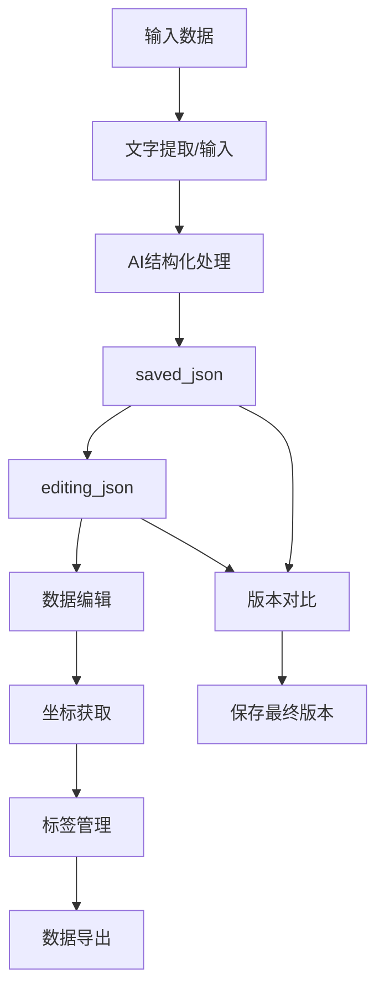

# 🗺️ AI地图数据生成器

> **智能地图数据提取与管理平台** - 基于AI的地点信息结构化处理工具，支持多种输入模式和智能编辑功能

[](https://www.python.org/downloads/)
[](https://streamlit.io)
[](https://opensource.org/licenses/MIT)
[](https://github.com/QwenLM/Qwen)

## 🌟 核心特性

### 🚀 **多模态数据输入**
- **📷 图片识别**：支持PNG、JPG、JPEG、WEBP格式，AI自动提取文字信息
- **🌐 在线图片**：直接处理网络图片URL，无需下载
- **📝 文本输入**：直接输入文字内容，跳过OCR步骤
- **📋 JSON导入**：支持现有JSON数据的导入和编辑

### 🤖 **AI智能处理**
- **视觉理解**：基于通义千问qwen-vl-max模型的图像文字识别
- **智能结构化**：qwen-max模型自动整理地点信息为标准格式
- **AI编辑助手**：自然语言指令批量编辑数据
- **智能建议**：基于数据内容生成地图信息建议

### 🎯 **数据管理系统**
- **三层数据架构**：extracted_text → saved_json → editing_json
- **版本控制**：编辑版本与保存版本分离，支持版本对比
- **数据验证**：自动检查和修复缺省数据字段
- **完整性统计**：实时显示数据质量和完整度

### 🛠️ **强大的编辑功能**
- **可视化表格编辑**：支持直接在表格中编辑数据
- **AI对话编辑**：用自然语言描述修改需求
- **批量操作**：一键清理、修复、更新数据
- **标签管理**：智能标签分类和批量操作

### 🌐 **地理编码服务**
- **精确定位**：腾讯地图API获取准确经纬度坐标
- **批量处理**：支持大量地点的坐标批量获取
- **坐标验证**：自动验证坐标范围和有效性
- **进度显示**：实时显示坐标获取进度

### 📊 **多格式导出**
- **完整地图JSON**：包含地图信息和地点数据
- **纯数据JSON**：仅包含地点数据数组
- **CSV表格**：支持Excel打开的表格格式
- **数据清理选项**：导出时自动清理空字段和无效数据

## 🚀 快速开始

### 1. 环境准备

```bash
# 克隆项目
git clone https://github.com/your-username/map_generator.git
cd map_generator

# 创建虚拟环境（推荐）
python -m venv venv
source venv/bin/activate  # Linux/Mac
# 或
venv\Scripts\activate     # Windows

# 安装依赖
pip install -r requirements.txt
```

### 2. API密钥配置

#### 🔧 方法1: Web界面配置（推荐）
1. 启动应用后在侧边栏输入API密钥
2. 点击"更新配置"按钮应用设置
3. 实时验证配置有效性

#### 🔧 方法2: 环境变量配置
```bash
# 创建环境变量文件
cp .env.example .env

# 编辑.env文件
QWEN_API_KEY="your_qwen_api_key_here"
TENCENT_API_KEY="your_tencent_api_key_here"
```

### 3. 启动应用

```bash
# 启动Web应用
streamlit run ai_agent_workflow.py

# 或使用启动脚本
python run_app.py
```

访问 `http://localhost:8501` 开始使用！

## 📖 使用指南

### 🎯 **完整工作流程**

#### 步骤1: 数据提取
1. **选择输入模式**：图片上传、图片链接、文本输入或JSON导入
2. **AI处理**：自动提取和识别地点信息
3. **生成结构化数据**：转换为标准JSON格式

#### 步骤2: 地图信息设置
1. **基本信息**：设置地图名称、描述、数据来源
2. **AI智能建议**：基于数据内容自动生成建议
3. **配置预览**：实时查看完整配置

#### 步骤3: 数据编辑与确认
1. **数据验证**：自动检查和修复缺省字段
2. **AI编辑**：使用自然语言指令批量修改
3. **表格编辑**：直接在表格中编辑单个字段
4. **版本管理**：编辑版本与保存版本分离

#### 步骤4: 坐标管理
1. **批量获取坐标**：自动获取所有地点的经纬度
2. **坐标验证**：检查坐标有效性和范围
3. **状态监控**：实时显示坐标获取状态

#### 步骤5: 标签管理
1. **智能标签**：AI自动生成和分类标签
2. **批量操作**：选择地点和标签进行批量管理
3. **表格编辑**：直接编辑标签信息

#### 步骤6: 数据导出
1. **格式选择**：JSON、CSV等多种格式
2. **数据清理**：自动清理空字段和无效数据
3. **质量统计**：显示数据完整性和质量指标

### 🤖 **AI编辑功能**

#### 自然语言指令示例：
```
• 删除所有没有电话号码的地点
• 将所有地址中的'街道'替换为'路'
• 为星巴克添加简介：知名国际咖啡连锁品牌
• 删除第2个地点
• 为所有餐厅类地点添加'美食'标签
```

#### 智能建议功能：
- 基于地点数据自动生成地图名称和描述
- 智能识别数据来源和类型
- 提供数据完善建议

## 🏗️ 技术架构

### 📦 **核心组件**

```
map_generator/
├── 🎯 主应用
│   ├── ai_agent_workflow.py      # Streamlit主应用 (710行)
│   └── run_app.py               # 启动脚本
├── 🧠 AI处理
│   ├── processor.py             # AI处理器
│   └── prompts/                 # AI提示词模板
├── 🗂️ 数据管理
│   ├── utils/
│   │   ├── data_manager.py      # 数据管理器
│   │   └── sidebar_components.py # 侧边栏组件
├── 🌐 地理服务
│   └── geo_service.py           # 地理编码服务 (286行)
├── 📱 用户界面
│   └── tabs/                    # 标签页组件
│       ├── tab_data_extraction.py
│       ├── tab_data_editing.py
│       ├── tab_coordinate_management.py
│       ├── tab_tag_management.py
│       ├── tab_map_info.py
│       └── tab_data_export.py
└── ⚙️ 配置
    └── config.py               # 配置管理 (80行)
```

### 🔧 **技术栈**

| 组件 | 技术 | 版本 | 用途 |
|------|------|------|------|
| **前端框架** | Streamlit | 1.28+ | Web界面和交互 |
| **AI模型** | 通义千问 | qwen-vl-max, qwen-max | 图像识别和文本处理 |
| **地理编码** | 腾讯地图API | v1 | 地址转坐标 |
| **图像处理** | Pillow | 10.0+ | 图片处理和格式转换 |
| **HTTP请求** | Requests | 2.31+ | API调用和图片下载 |
| **数据处理** | Pandas | 2.0+ | 数据表格操作 |

### 🔄 **数据流架构**



## 📊 数据格式规范

### 🗂️ **完整JSON结构**

```json
{
  "name": "地图名称",
  "description": "地图描述信息",
  "origin": "数据来源",
  "filter": {
    "inclusive": {
      "类型": ["餐厅", "咖啡厅"]
    },
    "exclusive": {
      "状态": ["已关闭"]
    }
  },
  "data": [
    {
      "name": "地点名称",
      "address": "详细地址",
      "phone": "联系电话",
      "webName": "网站/公众号",
      "intro": "简介描述",
      "tags": ["标签1", "标签2"],
      "center": {
        "lat": 31.123456,
        "lng": 121.654321
      }
    }
  ]
}
```

### 📋 **CSV导出格式**

| 名称 | 地址 | 电话 | 网站/公众号 | 简介 | 标签 | 纬度 | 经度 |
|------|------|------|-------------|------|------|------|------|
| 示例地点 | 上海市... | 021-1234... | example.com | 描述... | 餐厅,美食 | 31.123 | 121.654 |

## 🔑 API密钥获取指南

### 🤖 **通义千问API密钥**

1. **注册账号**
   - 访问 [阿里云模型工坊](https://dashscope.aliyun.com/)
   - 注册并完成实名认证

2. **开通服务**
   - 开通 `qwen-vl-max-latest` 模型（图像识别）
   - 开通 `qwen-max-latest` 模型（文本处理）

3. **获取密钥**
   - 在控制台创建API密钥
   - 复制密钥到应用配置中

### 🗺️ **腾讯地图API密钥**

1. **注册开发者**
   - 访问 [腾讯位置服务](https://lbs.qq.com/console/)
   - 注册开发者账号

2. **创建应用**
   - 创建新应用
   - 开通地理编码服务

3. **获取密钥**
   - 在应用管理中获取API密钥
   - 配置服务权限

## 🆕 版本更新日志

### 🎉 **v2.0.0** (最新版本)

#### 🚀 **重大更新**
- ✅ **全新数据管理架构**：三层数据结构，支持版本控制
- ✅ **AI编辑助手**：自然语言指令批量编辑数据
- ✅ **数据验证系统**：自动检查和修复缺省字段
- ✅ **智能标签管理**：AI驱动的标签分类和管理

#### 🛠️ **功能增强**
- ✅ **表格编辑器**：可视化数据编辑，支持动态添加/删除
- ✅ **完整性统计**：实时显示数据质量和完整度
- ✅ **版本对比**：编辑版本与保存版本的差异对比
- ✅ **批量修复**：一键修复所有缺省数据字段

#### 🎨 **界面优化**
- ✅ **模块化设计**：标签页组件化，代码结构更清晰
- ✅ **状态显示**：详细的数据状态和进度显示
- ✅ **错误处理**：友好的错误提示和解决建议

### 📈 **v1.2.0**
- ✅ JSON导入功能：支持现有数据的导入和编辑
- ✅ 数据清理优化：自动处理空格和格式问题
- ✅ 地图信息管理：独立的地图元数据配置

### 🔧 **v1.1.0**
- ✅ 多种输入模式：图片上传、链接、文本输入
- ✅ 动态API配置：运行时更新配置
- ✅ 用户体验优化：界面和操作流程改进

## 🤝 贡献指南

### 🛠️ **开发环境设置**

```bash
# 克隆开发分支
git clone -b develop https://github.com/your-username/map_generator.git
cd map_generator

# 安装开发依赖
pip install -r requirements-dev.txt

# 运行测试
python -m pytest tests/

# 代码格式化
black .
isort .
```

### 📝 **提交规范**

```bash
# 功能开发
git commit -m "feat: 添加新的数据验证功能"

# 问题修复
git commit -m "fix: 修复坐标获取失败的问题"

# 文档更新
git commit -m "docs: 更新API使用说明"
```

### 🐛 **问题反馈**

1. **Bug报告**：使用Issue模板详细描述问题
2. **功能建议**：在Discussions中讨论新功能
3. **代码贡献**：提交Pull Request前请先讨论

## 🔐 安全与隐私

### 🛡️ **数据安全**
- ✅ API密钥本地存储，不上传到服务器
- ✅ 图片处理完成后自动清理临时文件
- ✅ 支持离线模式（除地理编码外）

### 🔒 **隐私保护**
- ✅ 不收集用户个人信息
- ✅ 处理的数据仅在本地存储
- ✅ 可选择不使用地理编码服务

### ⚠️ **安全提醒**
- 🔑 定期轮换API密钥
- 📁 不要将`.env`文件提交到版本控制
- 🌐 使用HTTPS连接访问API服务

## 📞 支持与帮助

### 📚 **文档资源**
- 📖 [详细文档](https://github.com/your-username/map_generator/wiki)
- 🎥 [视频教程](https://www.youtube.com/playlist?list=xxx)
- 💡 [使用技巧](https://github.com/your-username/map_generator/discussions)

### 🆘 **获取帮助**
- 🐛 [问题反馈](https://github.com/your-username/map_generator/issues)
- 💬 [社区讨论](https://github.com/your-username/map_generator/discussions)
- 📧 [邮件支持](mailto:support@example.com)

### 🌟 **社区**
- ⭐ [GitHub Star](https://github.com/your-username/map_generator)
- 🍴 [Fork项目](https://github.com/your-username/map_generator/fork)
- 📢 [关注更新](https://github.com/your-username/map_generator/subscription)

## 📄 许可证

本项目采用 [MIT许可证](LICENSE) - 详情请查看LICENSE文件

---

<div align="center">

### 🗺️ **让地图数据处理变得简单高效**

[](https://github.com/your-username/map_generator)
[](https://github.com/your-username/map_generator)
[](https://github.com/your-username/map_generator/issues)

**[🚀 立即开始](https://github.com/your-username/map_generator)** | **[📖 查看文档](https://github.com/your-username/map_generator/wiki)** | **[💬 加入讨论](https://github.com/your-username/map_generator/discussions)**

</div> 